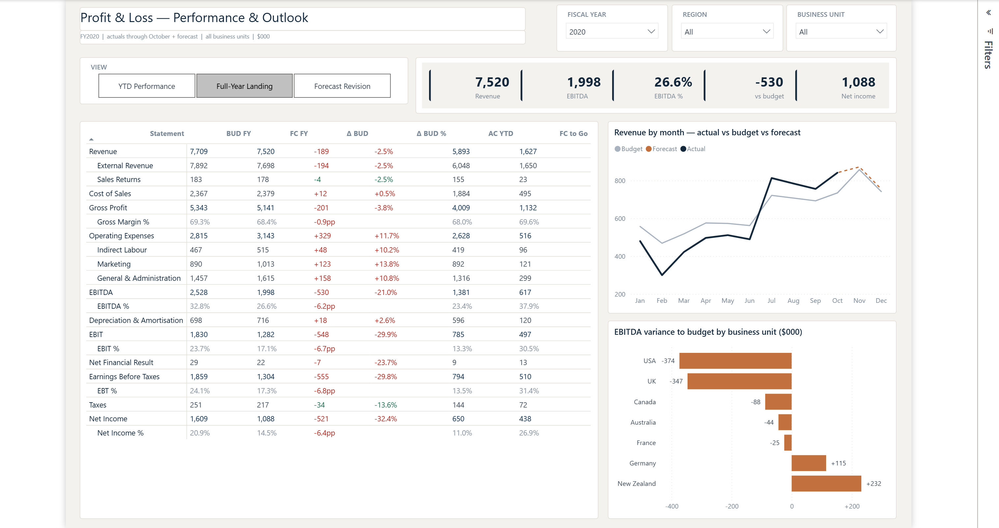

# P&L Performance & Outlook

A Power BI P&L report in the style of the LinkedIn example: one statement matrix, three views,
budget / forecast / actual side by side, with the full-year landing built from actuals to the
October close plus forecast for the months still open.



## Where the data comes from

**Source: [General Ledger (Financial data set)](https://www.kaggle.com/datasets/irfansharif/generalledger)
on Kaggle** — `Data file for students.xlsx`.

> **The data is not in this repository.** That dataset is published under
> *"Data files © Original Authors"* — Kaggle's default, which reserves all rights and grants no
> redistribution licence. So neither the source workbook nor the CSVs derived from it are
> committed here. Everything needed to rebuild them is: download the dataset from the link above,
> drop the `.xlsx` into `data/source/`, and run the ETL (see [Rebuilding](#rebuilding)). It takes
> a few seconds.

It is a genuine double-entry general ledger, which is why it was picked over the "budget vs
actual" datasets that come up first in search — those are expense trackers, not P&Ls:

| | |
|---|---|
| GL lines | 27,909, dated 2018-01-01 to 2020-12-31 |
| Chart of accounts | 54 accounts, 26 of them P&L, with a Class / SubClass / Account hierarchy |
| Entities | 7 territories across 3 regions — used as the business units |
| Scale | FY2020 revenue 7.8m, gross margin 68%, net income 1.3m |

Its account hierarchy maps almost one-for-one onto the reference report's line structure, so the
statement is a real chart of accounts rather than an invented one.

### What is real and what is not

**Actuals are the ledger, untouched.** Every actual figure is a sum of real GL postings.

**Budget and forecast are generated** — see `etl/build_star_schema.py`. No public dataset carries
plan data at account × entity × month grain; that is proprietary FP&A data. Rather than pretend
otherwise, the ETL builds a planning layer from the actuals with rules that are stated in one
place and are deterministic, so the numbers reproduce exactly on a re-run:

- **Budget FY(n)** — prior-year actual per account × territory, grown by a per-account-group
  planned rate, skewed slightly per territory, then spread across months on a *smoothed*
  prior-year seasonality curve. Smooth, set once before the year, never revised.
- **Forecast FY(n)** at an October close — actual for January to October, and for November and
  December the budget re-based by how that line has actually been running
  (`clamp(actual YTD / budget YTD, 0.7, 1.4)`) plus a small re-forecast bias.

The consequence is the report's story: revenue landing 2.5% under plan while operating expenses
run 11.7% over, so EBITDA lands 21% below budget — and the variance bar chart shows the miss
sitting in the USA, UK and Australia while Germany and New Zealand are ahead.

If you have real plan data, replace `Budget` and `Forecast` rows in `data/fact_pl.csv`; nothing
downstream cares where they came from.

## How the statement is built

The interesting part of a P&L report is that subtotal rows (Gross Profit, EBITDA, EBIT) and the
detail rows beneath them have to coexist in one matrix without double counting.

- **`P&L Line`** is a disconnected table of the 21 ordered reporting lines.
- **`PL Bridge`** maps each line to the accounts that roll into it — a subtotal maps to every
  account beneath it, so accounts deliberately appear against several lines.
- **`[_Raw]`** reads the account list for the line in filter context and applies it with
  `TREATAS`. Using a filter rather than a bi-directional relationship is what keeps the shared
  accounts from being counted twice.
- **`Display Sign`** (−1 on cost lines) flips costs to print positive the way a statement reads,
  and doubles as the favourability rule: `variance × display sign > 0` is a good outcome on every
  row, so "spent less than planned" colours green without a per-line exception list.
- **Margin rows** carry the account set of the subtotal they measure, so the same measures resolve
  to that subtotal and the ratio has a numerator. They render as a percentage, and their variance
  in percentage points.

`etl/build_star_schema.py` asserts the structure foots before it writes anything — every subtotal
must be exactly the union of the lines building up to it, with no account counted twice. That
check caught a missing interest-expense account in Net Income during the build.

### The three views

A slicer on `Report View[View]` switches the matrix columns:

| View | Columns |
|---|---|
| YTD Performance | Budget YTD, Actual YTD, Δ YTD, Δ YTD %, Prior Yr YTD, YoY % |
| Full-Year Landing | BUD FY, FC FY, Δ BUD, Δ BUD %, AC YTD, FC to Go |
| Forecast Revision | BUD FY, FC FY, Δ BUD, BUD to Go, FC to Go, Δ to Go |

The captions sit on the matrix's **column axis** and a single measure, `[Cell]`, resolves each
cell by asking which column it is in. So the column *headings* change with the view, not just the
numbers.

A field parameter is the more obvious way to do this, and it is what the original LinkedIn post
used. It was tried first and abandoned: a field parameter binds a column into a measure-only
role, and hand-authored PBIR renders it as *"Can't determine relationships between the fields"* —
Power BI never expands the parameter into the measures behind it. The disconnected-table approach
needs no special metadata and is a plain star-schema pattern.

## Layout

```
PL Performance and Outlook.pbip
├── PL Performance and Outlook.SemanticModel/   TMDL: 9 tables, 55 measures, 5 relationships
├── PL Performance and Outlook.Report/          PBIR: 1 page, 10 visuals
├── data/                                       not committed - see "Where the data comes from"
└── etl/
    ├── build_star_schema.py                    source workbook -> star schema
    ├── build_report.py                         generates every PBIR visual
    └── check_tmdl.ps1                          parses the TMDL before opening Desktop
```

## Rebuilding

Download [the dataset](https://www.kaggle.com/datasets/irfansharif/generalledger), put
`Data file for students.xlsx` in `data/source/`, then:

```bash
python etl/build_star_schema.py && python etl/build_report.py
```

The first script turns the ledger into the CSV star schema the model reads; the second
regenerates every PBIR visual. Needs Python with `openpyxl`.

Then validate the report definition and the model:

```bash
powerbi-report-author validate "PL Performance and Outlook.Report"
```

```bash
powershell -ExecutionPolicy Bypass -File etl/check_tmdl.ps1
```

Run `check_tmdl.ps1` before opening Desktop. Power BI Desktop's failure mode for a malformed TMDL
folder is to open a blank **"Untitled"** window with no error dialog at all, which is
indistinguishable from a slow load; the script parses the folder with the same serializer Desktop
uses and prints the offending document and line number.

The model finds the CSVs through the `Data Folder` expression in
`PL Performance and Outlook.SemanticModel/definition/expressions.tmdl`. It is an **absolute path**,
so after cloning, point it at your own copy of `data/` before refreshing — it is the only path in
the project and nothing else needs changing.

A PBIP opens with its partitions in a NoData state, so refresh before reading any figure on screen.

## Verification

The figures in the screenshot were checked against the model directly over XMLA rather than read
off the picture. The statement foots in all three views:

```
Revenue 7,520 − Cost of Sales 2,379          = Gross Profit 5,141
Gross Profit 5,141 − Operating Expenses 3,143 = EBITDA 1,998
EBITDA 1,998 − D&A 716                        = EBIT 1,282
EBIT 1,282 + Net Financial Result 22          = EBT 1,304
EBT 1,304 − Taxes 217                         = Net Income 1,088
AC YTD 5,893 + FC to Go 1,627                 = FC FY 7,520
```

## Licence

The code, semantic model and report definition in this repository are MIT licensed — see
[LICENSE](LICENSE).

This does **not** extend to the source dataset, which is not distributed here and remains the
property of its author under Kaggle's *"Data files © Original Authors"* terms.
